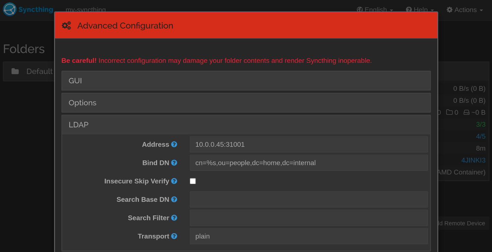

# Self-hosted IAM stack
This is a simple IAM platform for Kubernetes to add SSO capability to home lab services using OIDC, OAuth, and LDAP protocols. The stack composes of LLDAP as the base infrastructure layer serving as a centralized LDAP identity repository. Keycloak is deployed to implement application-layer features like SSO redirection using the OAuth/OIDC authentication flow. The identity information in LLDAP is synchronized to Keycloak using read-only user federation.

See more details in my [blog post](https://dev.to/patimapoochai/building-a-self-hosted-iam-platform-to-add-sso-to-my-home-lab-5a2n).


## How to deploy the stack
### 1. Clone the repository
```bash
git clone https://github.com/patimapoochai/self-hosted-iam.git
cd https://github.com/patimapoochai/self-hosted-iam.git
```
### 2. Modify the Helm chart's `values.yaml` file
Environment variables and other settings can be managed in the file `iam-stack/values.yaml`.Here is an example `values.yaml` file:
```yaml
keycloak:
  admin_username: "administrator"
  admin_password: "ChangeThis"

lldap:
  # lldap required environment variables (see lldap documentation)
  timezone: "Pacific/Honolulu"
  jwt_secret: "ChangeThisKey"
  key_seed: "AlsoChangeThisSecretKey"
  base_dn: "dc=home,dc=internal"
  user_password: "password"
  # lldap requires storage via a pvc, set pv location here
  pv_path: "/home/ansible/lldap/data"
```

Change each value to suit your deployment needs, particularly your distinguished name, secret keys, and time zone.

The LLDAP deployment currently uses a local-path persistent volume to store its data. The volume is mounted to the `pv_path` value, and you must ensure that this path exists for the node that would be running the lldap pod.

### 3. Deploy the Helm chart
```bash
helm install <DEPLOYMENT-NAME> ./iam-stack/
```

The current Helm chart uses NodePort services to expose Keycloak and LLDAP ports. Take note of the IP address of the nodes where the pods are running on and the services' ports:
```bash
k get po -o wide
k get svc
```


### 4. Configure Keycloak synchronization with LLDAP
Use [LLDAP's documentation on Keycloak Federation](https://github.com/lldap/lldap/blob/main/example_configs/keycloak.md). Basically, set up a read-only federation from LLDAP to Keycloak. This will synchronize the users from LLDAP into Keycloak.

Sign in to Keycloak using the username and passwords from the `values.yaml` file. By default, this is `administrator` and `ChangeThis`.

Navigate to the `User Federation` page and add a new LDAP provider using the settings from the LLDAP documentation.

A few things to note:
- Change your connection URL to `ldap://<ip-address-of-lldap-node>:31001`.
- Bind DN and Users DN should have the same domain component (`dc=`) value as the values in the `values.yaml` file.
- Bind credentials should be the `user_password` value in the LLDAP settings in the `values.yaml` file.


## Test the SSO functionality with Grafana and Syncthing
After configuring LLDAP, Keycloak, and federation between the two services, you should have a basic IAM stack that provides SSO functionality to a wide range of applications ready to go.

We can test this functionality by setting up a few basic services and configuring them to use our stack for authentication.

### LDAP with Syncthing
Deploy Syncthing using Docker Compose. These commands will deploy Syncthing to your desktop computer, and you can access the site at `http://localhost:18384`
```bash
cd syncthing
docker compose up -d
```

Follow the [LLDAP Syncthing documentation](https://github.com/lldap/lldap/blob/main/example_configs/syncthing.md). For a basic setup, you only need to fill in the Address and Bind DN fields. The Address field should use the IP address of the node running the LLDAP pod and the port of the NodePort service, e.g., `<ip-address-of-lldap-node>:31001`. Again, you should change the domain component to match the values that you set in the `values.yaml` file.


Create a test user in the LLDAP Users page.


Now, you should be able to log into Syncthing using this username and password.


### OIDC/OAuth with Grafana
Before you deploy Grafana using Docker Compose, make sure that the service's bind mount folders (`grafana/config` and `grafana/data`) have the correct ownership.

```bash
cd grafana
ls -la
total 20
drwxr-xr-x. 6        472        472 4096 May 13 20:04 data/
drwxr-xr-x. 3        472        472 4096 May 13 20:02 config/
```

Both folders should be owned by the UID of the user within the container in [Grafana's Dockerfile](https://github.com/grafana/grafana/blob/28b142e9513f587c4be62801794a8609037adbe8/Dockerfile#L138). In my case, the UID and GID should be `472`. If not, you can change the ownership of both folders:
```bash
sudo chown -R 472:472 data/
sudo chown -R 472:472 data/
```

You should also set the `root_url`, `domain`, and `http_port` settings in Grafana to match the URL you will access the public instance of your Grafana instance. For example, you might run the Keycloak pod and Grafana on your desktop computer, so you can set the `domain` setting to `localhost`. In my case, however, I deployed both Grafana and Keycloak on two separate headless servers. I would set the `domain` value for my deployment to be the public IP address or domain name of the server where Grafana is running on.


Deploy Grafana using Docker Compose.
```bash
docker compose up -d
```

Follow [Grafana's documentation on Keycloak OAuth2 authentication](https://grafana.com/docs/grafana/latest/setup-grafana/configure-security/configure-authentication/keycloak/). In short, create a new client in the Keycloak dashboard, and add that client as a generic OAuth provider in Grafana.

At the moment, Grafana's documentation is a bit outdated, so some property names are different in the Keycloak interface. For example, the `Access Type` property in the Grafana documentation is now called `Client authentication` in the Keycloak interface.


After setting up the Keycloak client and Grafana OAuth authentication, the login screen should now present the option to log in using Keycloak.


